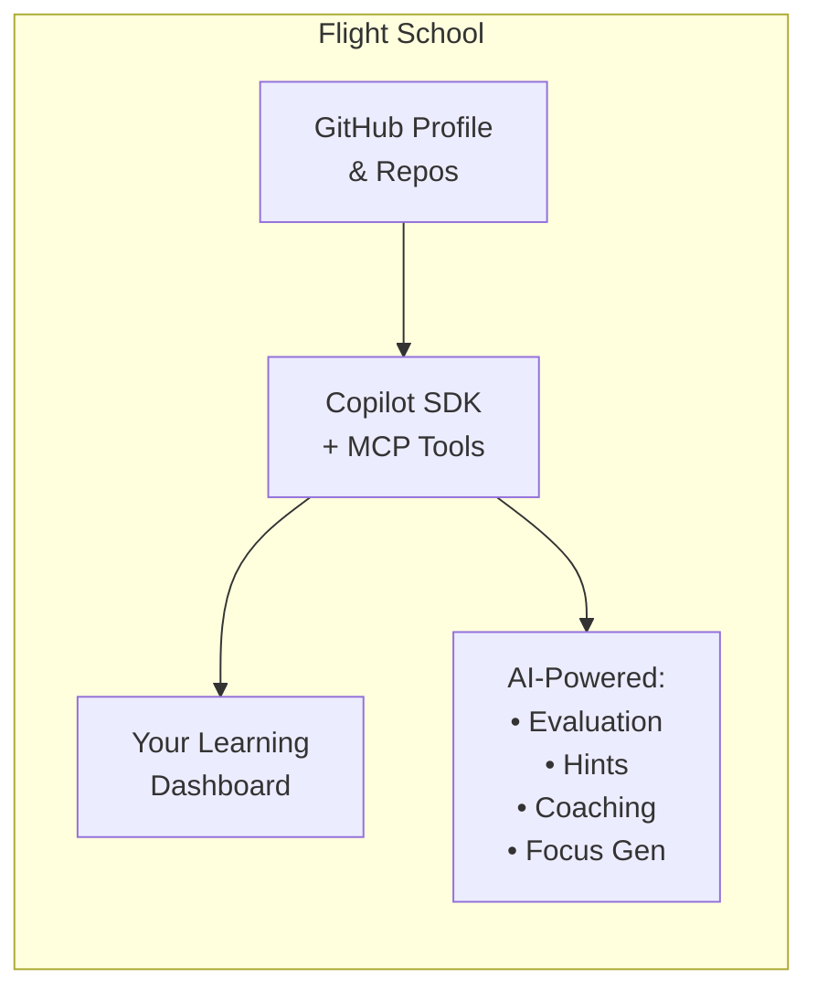

# Flight School

**Train with your Copilot. Reach new heights.**

Flight School is a sample implementation showing how to build AI-powered developer tools using the [GitHub Copilot SDK](https://github.com/github/copilot-sdk). It's a learning platform where developers practice coding challenges, receive real-time AI evaluation, and get personalized guidance all powered by GitHub Copilot.

## Getting Started

The fastest way to run Flight School is with **GitHub Codespaces** — everything is pre-configured:

1. Click **Code** → **Codespaces** → **Create codespace on main**
2. Wait for setup to complete (installs dependencies and tools automatically)
3. Run `gh auth login` to authenticate with GitHub
4. Run `npm run dev` to start the app

That's it! Open the preview URL and you're ready to go.

### Running Locally

To run Flight School on your own machine, you'll need:

- **Node.js 22+** — [Download here](https://nodejs.org/)
- **GitHub CLI** — [Installation guide](https://cli.github.com/)
- **GitHub Copilot CLI** — Required for AI features
- **GitHub Copilot access** — Individual, Business, or Enterprise subscription

#### Step 1: Install and authenticate GitHub CLI

```bash
# Install GitHub CLI (if not already installed)
# macOS
brew install gh

# Windows
winget install GitHub.cli

# Then authenticate
gh auth login
```

#### Step 2: Install GitHub Copilot CLI extension

The Copilot SDK uses the Copilot CLI for AI features. Install it as a GitHub CLI extension:

```bash
gh extension install github/gh-copilot
```

#### Step 3: Clone and run

```bash
git clone https://github.com/chrisreddington/flight-school.git
cd flight-school
npm install
npm run dev
```

Open [http://localhost:3000](http://localhost:3000) — you should see your GitHub profile loaded automatically.

### Alternative: Using a Personal Access Token

If you prefer not to use the GitHub CLI, you can authenticate with a Personal Access Token (PAT):

1. Go to [GitHub Settings → Developer settings → Personal access tokens → Tokens (classic)](https://github.com/settings/tokens)
2. Click **Generate new token (classic)**
3. Select these scopes:
   - `repo` — Access your repositories
   - `read:user` — Read your profile information
   - `read:org` — Read organization membership (optional)
4. Create a `.env.local` file in the project root:

```bash
GITHUB_TOKEN=ghp_your_token_here
```

> **Note:** You'll still need the GitHub Copilot CLI installed for AI-powered features like challenges, hints, and coaching. The token only handles GitHub API access for profile and repository data.

## Vision

AI can be a learning partner, not just a tool that helps generate solutions. Flight School explores how the Copilot SDK can create educational experiences that adapt to each developer's existing experience, their skill level, provide constructive feedback, and guide learners toward understanding.

## What It Does

Flight School gathers data from your GitHub profile and repositories through the Octokit package and uses the Copilot SDK to tailor a personalized learning experience:

- **Daily Focus** — A challenge, goal, and learning topics tailored to your skill gaps
- **Interactive Challenges** — Practice in a sandbox with real-time AI evaluation
- **Progressive Hints** — Get guidance without spoilers when you're stuck
- **Learning Conversations** — Chat with an AI coach about your code and repositories



## How It Uses the Copilot SDK

Flight School demonstrates several Copilot SDK patterns that you can adapt for your own applications:

### Session Management

The SDK's `CopilotClient` manages authenticated sessions. To optimize performance, Flight School creates different session types for different use cases:

- **Lightweight sessions** for fast responses (hints, quick chats)
- **MCP-enabled sessions** when GitHub exploration is needed (repo search, file contents, etc.)
- **Conversation caching** for multi-turn chats that maintain context

### MCP Tool Integration

Flight School connects to [GitHub's Remote MCP Server](https://github.com/github/github-mcp-server), giving the AI access to GitHub tools like `get_me`, `list_user_repositories`, and `search_code`. This enables context-aware responses based on your actual repositories in the chat experience.

### Streaming Responses

The chat and challenge evaluation experiences stream feedback in real-time using the SDK's streaming mode, showing results as they're generated rather than waiting for the full response.

## Available Commands

| Command | Description |
|---------|-------------|
| `npm run dev` | Start development server |
| `npm run build` | Create production build |
| `npm run lint` | Run ESLint |
| `npm test` | Run tests |
| `npm run test:watch` | Run tests in watch mode |

## Contributing

We welcome contributions! Flight School is both a learning platform and a reference implementation. Improving either helps the community.

### Ways to Contribute

- **Report bugs** — Open an issue with reproduction steps
- **Suggest features** — Describe your use case in an issue
- **Improve documentation** — Help others understand the SDK patterns
- **Submit code** — Fix bugs or implement features

### Development Workflow

1. Fork the repository
2. Create a feature branch (`feature/your-feature-name`)
3. Make your changes with clear commits
4. Run tests (`npm test`) and linting (`npm run lint`)
5. Open a Pull Request

See [CONTRIBUTING.md](CONTRIBUTING.md) for commit conventions, testing practices, and code review process.

## Local Data Storage

Flight School stores your data **outside the repository** in your user data directory to prevent accidental commits:

| Platform | Location |
|----------|----------|
| **Linux/macOS** | `~/.local/share/flight-school/` |
| **Windows** | `%LOCALAPPDATA%\flight-school\` |
| **Custom** | Set `FLIGHT_SCHOOL_DATA_DIR` environment variable |

### What's Stored

| File | Contents |
|------|----------|
| `profile-cache.json` | Cached GitHub profile (username, avatar, bio, repos) |
| `focus-storage.json` | Daily challenges, goals, learning topics, completion states |
| `habits.json` | Your custom learning habits and progress tracking |
| `threads.json` | Chat conversation history with the AI coach |
| `workspaces/{id}/` | Challenge solution code and metadata |

### Storage Structure

```
~/.local/share/flight-school/    # or %LOCALAPPDATA%\flight-school\ on Windows
├── profile-cache.json           # GitHub profile cache
├── focus-storage.json           # Daily focus content + state
├── habits.json                  # Learning habits
├── threads.json                 # Chat history
└── workspaces/                  # Challenge workspaces
    └── {challengeId}/
        ├── _workspace.json      # Metadata
        └── solution.ts          # Your code files
```

- **Chat history** may contain sensitive info based on whatever you discuss with the AI coach.
- **Workspace files** contain your actual solution code for challenges.

### Precautions

1. **Back up before clearing** — Delete the data folder to reset all local state

## Tech Stack

- **Framework**: [Next.js with App Router](https://nextjs.org/docs/app)
- **UI**: [GitHub Primer React Components](https://primer.style/react/)
- **AI**: [GitHub Copilot SDK](https://github.com/github/copilot-sdk) with MCP tool integration
- **Data**: [Octokit](https://github.com/octokit/octokit.js) for GitHub API access
- **Storage**: Local JSON files in user data directory (see above)
- **Testing**: [Vitest](https://vitest.dev/)

## License

This project is licensed under the MIT License—see the [LICENSE](LICENSE) file for details.
