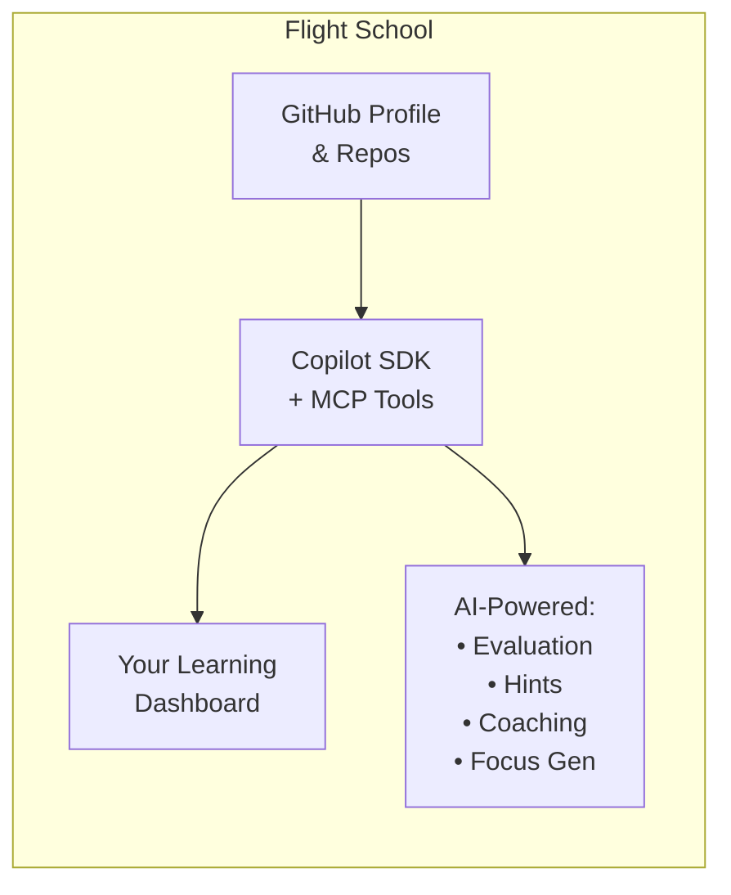

# Flight School

**Train with your Copilot. Reach new heights.**

Flight School is a sample implementation showing how to build AI-powered developer tools using the [GitHub Copilot SDK](https://github.com/github/copilot-sdk). It's a learning platform where developers practice coding challenges, receive real-time AI evaluation, and get personalized guidance all powered by GitHub Copilot.

> [!WARNING]
> **Exploratory project — not production ready.**
> Flight School is an experiment for trying the latest capabilities across **GitHub**, the **Copilot SDK**, **Aspire**, and related tooling.
> It is **not recommended for production use**.

## Getting Started

Flight School is multi-tenant: it authenticates each developer via a
[GitHub App](https://docs.github.com/en/apps) OAuth flow (Auth.js v5) and
threads the resulting user-to-server (`ghu_`) token through every GitHub API
call and Copilot SDK session. To run it locally you need to register a
GitHub App and supply `AUTH_*` credentials.

### Local dev quickstart

1. **Register a GitHub App** at <https://github.com/settings/apps/new>:
   - **Homepage URL:** `http://localhost:3000`
   - **Callback URL:** `http://localhost:3000/api/auth/callback/github`
   - Enable **"Request user authorization (OAuth) during installation"**.
   - Generate a client secret.
2. **Configure environment.** Copy `.env.example` to `.env.local` and fill
   in:

   ```bash
   AUTH_SECRET=                  # openssl rand -base64 32
   AUTH_GITHUB_ID=               # GitHub App client id
   AUTH_GITHUB_SECRET=           # GitHub App client secret
   AUTH_TRUST_HOST=true
   ```
3. **Install and run:**

   ```bash
   git clone https://github.com/chrisreddington/flight-school.git
   cd flight-school
   npm install
   npm run dev
   ```
4. Open <http://localhost:3000> — you'll be redirected to GitHub to authorize
   the app, then back to your personalized dashboard.

> **Prerequisites:** Node.js 22+, npm, Git, and a GitHub Copilot subscription
> (Individual, Business, or Enterprise) for the AI features.

### Deploy to Azure Container Apps (experimental)

Experimental ACA deployment notes:

- [`docs/deployment-aca.md`](docs/deployment-aca.md) — Container image build,
  ACA deployment checklist for lab/test environments (env vars, Key Vault secrets, monitoring,
  rate-limit tuning).
- [`infra/README.md`](infra/README.md) — Bicep modules, GitHub App setup
  against the ACA FQDN, deploy / rotate / cleanup recipes.
- [`docs/architecture-multitenant.md`](docs/architecture-multitenant.md) —
  Multi-tenant design (Auth.js → per-request Octokit → per-session Copilot
  SDK identity).

### Codespaces

Click **Code → Codespaces → Create codespace on main**. The dev container
installs dependencies automatically; you still need to register a GitHub App
(callback `https://<codespace-host>/api/auth/callback/github`) and populate
`.env.local` before running `npm run dev`.

## Vision

AI can be a learning partner, not just a tool that helps generate solutions. Flight School explores how the Copilot SDK can create educational experiences that adapt to each developer's existing experience, their skill level, provide constructive feedback, and guide learners toward understanding.

## What It Does

Flight School gathers data from your GitHub profile and repositories through the Octokit package and uses the Copilot SDK to tailor a personalized learning experience:

- **Daily Focus** — A challenge, goal, and learning topics tailored to your skill gaps
- **Interactive Challenges** — Practice in a sandbox with real-time AI evaluation
- **Progressive Hints** — Get guidance without spoilers when you're stuck
- **Learning Conversations** — Chat with an AI coach about your code and repositories


```mermaid
flowchart LR
    subgraph Flight School
        A[GitHub Profile<br>& Repos] --> B[Copilot SDK<br>+ MCP Tools]
        B --> C[Your Learning<br>Dashboard]
        B --> D[AI-Powered:<br>• Evaluation<br>• Hints<br>• Coaching<br>• Focus Gen]
    end
```

## How It Uses the Copilot SDK

Flight School demonstrates several Copilot SDK patterns that you can adapt for your own applications:

### Session Management

The SDK's `CopilotClient` manages authenticated sessions. To optimize performance, Flight School creates different session types for different use cases:

- **Lightweight sessions** for fast responses (hints, quick chats)
- **MCP-enabled sessions** when GitHub exploration is needed (repo search, file contents, etc.)
- **Conversation caching** for multi-turn chats that maintain context

### MCP Tool Integration

Flight School connects to [GitHub's Remote MCP Server](https://github.com/github/github-mcp-server), giving the AI access to GitHub tools like `get_me`, `list_user_repositories`, and `search_code`. This enables context-aware responses based on your actual repositories in the chat experience.

### Streaming Responses

The chat and challenge evaluation experiences stream feedback in real-time using the SDK's streaming mode, showing results as they're generated rather than waiting for the full response.

## Available Commands

| Command | Description |
|---------|-------------|
| `npm run dev` | Start development server |
| `npm run build` | Create production build |
| `npm run lint` | Run ESLint |
| `npm test` | Run tests |
| `npm run test:watch` | Run tests in watch mode |
| `npm run dashboard` | Start Aspire Dashboard (standalone OTLP receiver) |
| `npm run aspire:run` | Run the Aspire TypeScript AppHost |
| `npm run aspire:mcp` | Start Aspire MCP server against the dashboard |
| `npm run aspire:deploy` | Deploy AppHost resources to Azure Container Apps |
| `npm run aspire:destroy` | Tear down deployed Aspire Azure resources |

## OpenTelemetry + Aspire Dashboard

Flight School now registers OpenTelemetry via `@vercel/otel` in `src/instrumentation.ts`.
When running with Aspire Dashboard, traces and metrics include:

- Next.js API request timelines
- GitHub API request spans (including rate-limit headers when available)
- Copilot SDK session spans (`createSession`, `sendAndWait`, streaming duration)
- Trace IDs injected into structured logger payloads

Start the local dashboard and app:

```bash
npm run dashboard
npm run dev
```

By default, the dashboard listens on:
- UI: `http://localhost:18888`
- OTLP/HTTP: `http://localhost:4318`

> `npm run dashboard` uses `--allow-anonymous`; keep this local-only.

## Aspire AppHost (Stage 2)

This repository includes a TypeScript Aspire AppHost:

- `apphost.ts` orchestrates the Next.js app with `addNextJsApp(...)`
- `aspire.config.json` configures the TypeScript AppHost profile
- AppHost includes an Azure Container Apps environment (`addAzureContainerAppEnvironment("aca-env")`)

`aspire init --language typescript` generates the `.modules/` runtime helpers used by the AppHost. These files are local setup artifacts and should not be committed.

### Agent-driven debugging

Run Aspire MCP in dashboard mode so coding agents can inspect traces/logs:

```bash
npm run aspire:mcp
```

You can also use the included skill file:

- `.github/skills/aspire-debugging/SKILL.md`

### Container Apps deployment

1. Install Aspire CLI and Azure CLI
2. Authenticate to Azure:

```bash
az login
```

3. Initialize Aspire TypeScript AppHost modules (one-time per setup):

```bash
aspire init --language typescript
```

4. Add Azure App Containers integration (one-time per setup):

```bash
aspire add azure-appcontainers
```

5. Deploy:

```bash
npm run aspire:deploy
```

## Contributing

We welcome contributions! Flight School is both a learning platform and a reference implementation. Improving either helps the community.

### Ways to Contribute

- **Report bugs** — Open an issue with reproduction steps
- **Suggest features** — Describe your use case in an issue
- **Improve documentation** — Help others understand the SDK patterns
- **Submit code** — Fix bugs or implement features

### Development Workflow

1. Fork the repository
2. Create a feature branch (`feature/your-feature-name`)
3. Make your changes with clear commits
4. Run tests (`npm test`) and linting (`npm run lint`)
5. Open a Pull Request

See [CONTRIBUTING.md](CONTRIBUTING.md) for commit conventions, testing practices, and code review process.

## Local Data Storage

Flight School stores your data **outside the repository** in your user data directory to prevent accidental commits:

| Platform | Location |
|----------|----------|
| **Linux/macOS** | `~/.local/share/flight-school/` |
| **Windows** | `%LOCALAPPDATA%\flight-school\` |
| **Custom** | Set `FLIGHT_SCHOOL_DATA_DIR` environment variable |

### What's Stored

| File | Contents |
|------|----------|
| `profile-cache.json` | Cached GitHub profile (username, avatar, bio, repos) |
| `focus-storage.json` | Daily challenges, goals, learning topics, completion states |
| `habits.json` | Your custom learning habits and progress tracking |
| `threads.json` | Chat conversation history with the AI coach |
| `workspaces/{id}/` | Challenge solution code and metadata |

### Storage Structure

```
~/.local/share/flight-school/    # or %LOCALAPPDATA%\flight-school\ on Windows
├── profile-cache.json           # GitHub profile cache
├── focus-storage.json           # Daily focus content + state
├── habits.json                  # Learning habits
├── threads.json                 # Chat history
└── workspaces/                  # Challenge workspaces
    └── {challengeId}/
        ├── _workspace.json      # Metadata
        └── solution.ts          # Your code files
```

- **Chat history** may contain sensitive info based on whatever you discuss with the AI coach.
- **Workspace files** contain your actual solution code for challenges.

### Precautions

1. **Back up before clearing** — Delete the data folder to reset all local state

## Tech Stack

- **Framework**: [Next.js with App Router](https://nextjs.org/docs/app)
- **UI**: [GitHub Primer React Components](https://primer.style/react/)
- **AI**: [GitHub Copilot SDK](https://github.com/github/copilot-sdk) with MCP tool integration
- **Data**: [Octokit](https://github.com/octokit/octokit.js) for GitHub API access
- **Storage**: Local JSON files in user data directory (see above)
- **Testing**: [Vitest](https://vitest.dev/)

## License

This project is licensed under the MIT License—see the [LICENSE](LICENSE) file for details.
