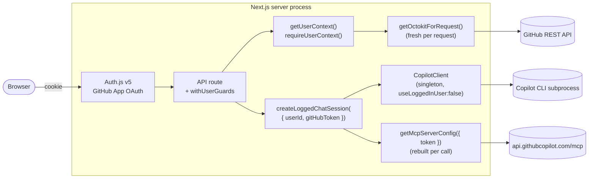

# Multi-tenant Architecture

Flight School is multi-tenant: every incoming HTTP request is authenticated as
a specific GitHub user, and that user's GitHub App user-to-server (`ghu_`)
token flows all the way down to GitHub API calls **and** to the Copilot SDK
session that handles AI work for that request. There is no process-wide token,
no Octokit singleton, and no shared identity between users.

## High-level data flow

## Why one `CopilotClient` can serve every user

The Copilot SDK supports per-session GitHub identity via
[`SessionOptions.gitHubToken`](https://github.com/github/copilot-sdk). Because
of that, we construct **one** `CopilotClient` per Node process (see
`src/lib/copilot/sessions.ts`):

- The client is created with `useLoggedInUser: false`, so it never inherits
  the host's ambient `gh auth` identity.
- Every `copilot.createSession({ ... })` call passes the caller's
  `gitHubToken`, scoping that session — and every tool call inside it — to
  that user.
- MCP server config is **rebuilt per call** with the same per-session token
  (`getMcpServerConfig({ token })` in `src/lib/copilot/mcp.ts`), so MCP HTTP
  requests carry the requesting user's `Authorization` header.

Result: a single long-lived Copilot CLI subprocess multiplexes work for many
users without ever mixing their tokens.

## Cross-cutting guarantees

- **No singleton tokens.** Octokit instances are constructed per request via
  `getOctokitForToken(token)` / `getOctokitForRequest()`. The deprecated
  `getGitHubToken()` exists only for boot-time / instrumentation paths and is
  never called by request handlers.
- **gh CLI fallback is dev-only.** `getTokenFromGhCli()` short-circuits when
  `NODE_ENV === 'production'` or `ACA_DEPLOYMENT === 'true'`.
- **User-keyed chat session cache.** The Copilot conversation cache key is
  `${userId}:${poolKey}:${conversationId}` (see `chatSessionCache` in
  `src/lib/copilot/sessions.ts`). Two users sharing a conversation ID never
  collide.
- **MCP config rebuilt per call.** `getMcpServerConfig` throws if no token is
  supplied and never caches a config across users.
- **Audit log on every guarded operation.** `withUserGuards` in
  `src/lib/security/guard.ts` emits an audit event (with `hashUserId` of the
  caller) for each rate-limited, capped session creation.
- **Per-user abuse controls.** Sliding-window rate limit
  (`src/lib/security/rate-limit.ts`) and concurrent-session cap
  (`src/lib/security/session-cap.ts`) are keyed on `userId`, not IP.

## Key entry points

| Concern | Module | Symbol |
|---|---|---|
| Auth.js session | `src/lib/auth/config.ts` | `auth`, `handlers`, `signIn`, `signOut` |
| User context in handlers | `src/lib/auth/context.ts` | `getUserContext`, `requireUserContext`, `UnauthorizedError` |
| Per-request Octokit | `src/lib/github/client.ts` | `getOctokitForRequest`, `getOctokitForToken` |
| Copilot session factory | `src/lib/copilot/sessions.ts` | `createSessionWithMetrics`, `getConversationSession` |
| Logged session helpers | `src/lib/copilot/server.ts` | `createLoggedChatSession`, `createLoggedCoachSession`, `SessionIdentity` |
| MCP per-call config | `src/lib/copilot/mcp.ts` | `getMcpServerConfig` |
| Route guard composition | `src/lib/security/guard.ts` | `withUserGuards` |
| Audit + abuse controls | `src/lib/security/` | `auditLog`, `checkRateLimit`, `acquireSlot` |

## Anti-patterns to reject in review

- Reading `process.env.GITHUB_TOKEN` outside `src/lib/github/client.ts`.
- Caching an `Octokit` instance at module scope.
- Calling `new CopilotClient(...)` outside `src/lib/copilot/sessions.ts`.
- Creating a session without passing `gitHubToken`, or passing one user's
  token into another user's session cache key.
- Using `getGitHubToken()` or `isGitHubConfigured()` inside a request handler.

## Related docs

- [`docs/deployment-aca.md`](deployment-aca.md) — Container image + ACA
  production checklist.
- [`infra/README.md`](../infra/README.md) — Bicep modules, Key Vault secrets,
  GitHub App setup.
- [`docs/migrations/2025-multitenant-auth.md`](migrations/2025-multitenant-auth.md)
  — Before/after for developers upgrading from the single-tenant model.
