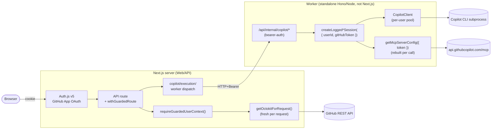

# Multi-tenant Architecture

> [!TIP]
> **Start with [`docs/architecture.md`](architecture.md)** for the
> story-level overview, system diagrams, and the five load-bearing
> decisions. This document is the threat-model-grade deep dive: it
> enumerates the multi-tenant invariants the rest of the system has to
> uphold (per-request Octokit, per-session Copilot identity, token store
> CAS / AAD binding / DEK cache, no tokens on the public session,
> background jobs, etc.).

> [!WARNING]
> **Exploratory project — not a reference architecture.** Flight School is a
> single-developer experiment; this document captures the current state, not
> a recommended design. Expect rough edges and pending refactors. Don't copy
> these patterns into production without independent review.

Flight School is multi-tenant: every incoming HTTP request is authenticated as
a specific GitHub user, and that user's GitHub App user-to-server (`ghu_`)
token flows all the way down to GitHub API calls **and** to the Copilot SDK
session that handles AI work for that request. There is no process-wide token,
no Octokit singleton, and no shared identity between users. Public Copilot
execution is routed to a mandatory private worker with a per-user runtime
pool — the web layer never runs the Copilot SDK in-process for public
traffic.

## High-level data flow



## Copilot runtime model

The Copilot SDK supports per-session GitHub identity via
[`SessionOptions.gitHubToken`](https://github.com/github/copilot-sdk). We use
that aggressively so the worker can multiplex many tenants safely:

- **No `useLoggedInUser: true` anywhere.** Every `CopilotClient` is created
  with `useLoggedInUser: false`, so the SDK never inherits the host's
  ambient `gh auth` identity.
- **Every session passes `gitHubToken`.** `copilot.createSession({ ... })`
  is always called with the requesting user's `ghu_` token, scoping the
  session — and every tool call inside it — to that user.
- **MCP config is rebuilt per call.** `getMcpServerConfig({ token })` in
  `src/lib/copilot/mcp.ts` throws when no token is supplied and never
  caches a config across users; MCP HTTP requests carry the requesting
  user's `Authorization` header.

### Execution boundary is worker-only

Public chat execution is mandatory-worker. `src/lib/copilot/execution/`
dispatches `executeCopilotChat()` to the private worker over HTTP:

- If `COPILOT_WORKER_URL` is unset, `executeCopilotChat()` throws a typed
  `CopilotWorkerRequiredError` and `/api/copilot` fails fast. The web
  process never runs the SDK in-process for public chat.
- The web process posts to `/api/internal/copilot/execute` on the worker
  with a bearer secret and a timeout. The worker is a standalone Node
  process (Hono, not Next.js) listening only inside the private
  ingress — `src/proxy.ts` rejects any browser-side hit on
  `/api/internal/*` because no Next route exists at those paths.

### Per-user runtime pool on the worker

The worker owns a per-user Copilot runtime pool
(`src/lib/copilot/runtime/`). Each runtime owns:

- A separate SDK-spawned `CopilotClient` + Copilot CLI child process.
- A user-specific `COPILOT_HOME` directory.
- An idle TTL, a max-active cap, and an eviction loop.

Runtime controls:

| Env | Default | Purpose |
|---|---|---|
| `COPILOT_RUNTIME_IDLE_TTL_MS` | `600000` (10 min) | Idle runtime is evicted after this. |
| `COPILOT_RUNTIME_MAX_ACTIVE` | `3` | Maximum concurrent active per-user runtimes. |
| `COPILOT_RUNTIME_HOME_ROOT` | `$FLIGHT_SCHOOL_DATA_DIR/copilot-runtimes` | Root for per-user `COPILOT_HOME` dirs. |

Constructing a `CopilotClient` outside `src/lib/copilot/sessions.ts` (or
the per-user runtime pool, which is the legitimate site for it) is an
anti-pattern. The singleton-client rule applies to **the web layer**; the
runtime pool legitimately creates one client per active user.

Durable async job execution through Service Bus and external `cliUrl`
runtime servers remain future work; the installed SDK rejects `cliUrl`
combined with `gitHubToken` / `useLoggedInUser`.

## Cross-cutting guarantees

- **No singleton tokens.** Octokit instances are constructed per request via
  `getOctokitForToken(token)` / `getOctokitForRequest()`. There is no
  ambient token resolution — every token originates from
  `requireUserContext()`.
- **No CLI / env back doors.** The client module does not import
  `child_process` and does not read `process.env.GITHUB_TOKEN`. Local dev
  signs in via the OAuth flow just like production.
- **User-keyed chat session cache.** The Copilot conversation cache key is
  `${userId}:${poolKey}:${conversationId}` (see `chatSessionCache` in
  `src/lib/copilot/sessions.ts`), where `poolKey` is the capability
  fingerprint produced by `composeCapabilityFingerprint(capabilities,
  systemMessage)` in `src/lib/copilot/fingerprint.ts`. The fingerprint
  hashes the resolved capability surface AND the composed system
  message, so two sessions with the same caps but different prompts
  never share a pooled CLI process. Two users sharing a conversation
  ID never collide.
- **Capability surface is monotonic-add per conversation.** Resolved
  capabilities are persisted to the per-user/per-conversation memory in
  `src/lib/copilot/conversation-capabilities.ts` BEFORE `sendAndWait`,
  in both the streaming chat factory and the direct worker path
  (`runtime/session-executor.ts`). A mid-turn failure does not shrink
  the next turn's surface. Memory is bounded (TTL + LRU) per user.
- **MCP config rebuilt per call.** `getMcpServerConfig` throws if no token is
  supplied and never caches a config across users.
  `buildMcpServersForCapabilities(selections, credentials)` in
  `src/lib/copilot/capabilities.ts` strict-throws when a selected MCP
  capability has no credential — preserves the
  fingerprint-equals-installed-surface invariant.
- **Audit log on every guarded operation.** `withUserGuards` in
  `src/lib/security/guard.ts` emits an audit event (with `hashUserId` of the
  caller) for each rate-limited, capped session creation.
- **Per-user abuse controls.** Sliding-window rate limit
  (`src/lib/security/rate-limit.ts`) and concurrent-session cap
  (`src/lib/security/session-cap.ts`) are keyed on `userId`, not IP.

## Key entry points

| Concern | Module | Symbol |
|---|---|---|
| Auth.js session | `src/lib/auth/config.ts` | `auth`, `handlers`, `signIn`, `signOut` |
| User context in handlers | `src/lib/auth/context.ts` | `getUserContext`, `requireUserContext`, `UnauthorizedError` |
| Per-request Octokit | `src/lib/github/client.ts` | `getOctokitForRequest`, `getOctokitForToken` |
| Copilot execution boundary | `src/lib/copilot/execution/` | `executeCopilotChat`, `executeCopilotCoachJob`, `openCopilotAuthoringStreamViaWorker` |
| Copilot session factory (worker-only) | `src/lib/copilot/sessions.ts` | `createSessionWithMetrics`, `getConversationSession` |
| Logged session helpers (worker-only) | `src/lib/copilot/server.ts` | `createLoggedCoachSession`, `createLoggedLightweightCoachSession`, `wrapSessionWithLogging` |
| MCP per-call config | `src/lib/copilot/mcp.ts` | `getMcpServerConfig` |
| Capability + profile composition | `src/lib/copilot/profiles.ts`, `src/lib/copilot/capabilities.ts` | `resolveProfile`, `buildMcpServersForCapabilities`, `CapabilityCredentialResolver` |
| Session-cache fingerprint contract | `src/lib/copilot/fingerprint.ts` | `composeCapabilityFingerprint`, `capabilityFingerprintOf` |
| Per-conversation capability memory | `src/lib/copilot/conversation-capabilities.ts` | `getConversationCapabilities`, `rememberConversationCapabilities` |
| Worker-ready job dispatch | `src/app/api/jobs/dispatcher.ts` | `dispatchJobExecution` (web -> worker HTTP dispatch) |
| Prototype runtime-pool contracts | `src/lib/copilot/runtime/` | `createPerUserRuntimePool`, `CopilotRuntimePool` |
| Route guard composition | `src/lib/security/guard.ts` | `requireGuardedUserContext`, `withUserGuards`, `withGuardedRoute` |
| Audit + abuse controls | `src/lib/security/` | `auditLog`, `checkRateLimit`, `acquireSlot` |

## Storage isolation

The server-side storage APIs — `/api/threads/storage`, `/api/focus/storage`,
and `/api/workspace/storage` (plus `/api/workspace/storage/list`) — are
**partitioned per authenticated user** on disk. The shared
`createStorageRoute` factory in `src/lib/api/storage-route-factory.ts` and the
workspace route both resolve the caller's identity via `requireUserContext()`
and rewrite the storage path to live under a per-user subdirectory:

```text
{FLIGHT_SCHOOL_DATA_DIR}/users/{userId}/threads.json
{FLIGHT_SCHOOL_DATA_DIR}/users/{userId}/focus-storage.json
{FLIGHT_SCHOOL_DATA_DIR}/users/{userId}/workspaces/{challengeId}/...
```

`{userId}` is the numeric GitHub user ID taken from the Auth.js session —
never from a query string or request body. Before it is used as a path
segment it is validated against `/^[a-zA-Z0-9_-]+$/`; anything else
(including `..`, `/`, `.`) is rejected with HTTP 400. The per-user directory
is created on demand with mode `0o700` on platforms that honour POSIX modes.

### Guarantees

- **GET returns the caller's data only.** User A's `GET /api/threads/storage`
  sees the default empty schema even if User B has written threads, because
  A's path doesn't exist on disk.
- **DELETE only clears the caller's file.** User A deleting their workspace
  cannot affect User B's `users/{B}/workspaces/...`.
- **Unauthenticated requests return 401** before any filesystem call.
- **Path-traversal is rejected with 400** rather than silently sandboxed.

### Migration policy

The pre-multitenant code wrote storage files directly at the root of
`FLIGHT_SCHOOL_DATA_DIR` (e.g. `threads.json` at the top level). Those files
are **ignored** by the multi-tenant code — there is no automatic migration.
This is safe because the multi-tenant version is not yet deployed to
production. Developers running local dev environments can delete the old
files manually:

```sh
# macOS/Linux default location
rm -rf ~/.local/share/flight-school/threads.json \
       ~/.local/share/flight-school/focus-storage.json \
       ~/.local/share/flight-school/workspaces/
```

See [`src/lib/api/MIGRATION.md`](../src/lib/api/MIGRATION.md) for the same
note alongside the code.

## Anti-patterns to reject in review

- Reading `process.env.GITHUB_TOKEN` anywhere in production code. There is
  no ambient identity — even in local dev, sign in via the OAuth flow.
- Shelling out to `gh auth token` or any other CLI to resolve a GitHub
  token. The client module no longer imports `child_process`.
- Caching an `Octokit` instance at module scope.
- Calling `new CopilotClient(...)` outside `src/lib/copilot/sessions.ts`.
- Creating a session without passing `gitHubToken`, or passing one user's
  token into another user's session cache key.
- Resolving a token outside `requireUserContext()` / `getUserContext()`.
- Writing or reading server-side storage files at the storage root rather
  than under `users/{userId}/...`. All storage routes derive the userId from
  `requireUserContext()`; the caller is never trusted to supply it.
- **Bypassing the guard primitive in Server Actions or Server Components.**
  Every exported `'use server'` action and every Server Component data
  loader that touches per-user data must call the shared
  `requireGuardedUserContext()` core (the same primitive `withUserGuards`
  uses for API routes). Duplicating auth/rate-limit/audit logic into a
  Server Action — or skipping it — is an automatic review block.
- **Caching per-user data without a tenant-scoped tag.** Every
  `'use cache'` directive, `cacheTag()`, `revalidateTag()`, and
  `updateTag()` must include the user scope as part of the key (minimum
  `user:${userId}`, extended with `:session:`, `:repo:`, `:installation:`
  when the cached data is keyed on those). The only exception is data
  explicitly tagged `public:` with a one-line justification — and per-user
  GitHub data can never qualify.

## Related docs

- [`docs/deployment-aca.md`](deployment-aca.md) — Container image + ACA
  production checklist.
- [`infra/README.md`](../infra/README.md) — Bicep modules, Key Vault secrets,
  GitHub App setup.
- [`docs/migrations/2025-multitenant-auth.md`](migrations/2025-multitenant-auth.md)
  — Before/after for developers upgrading from the single-tenant model.

## Token storage

GitHub user-to-server tokens (`ghu_` access, `ghr_` refresh) are persisted via
the {@link TokenStore} abstraction in `src/lib/auth/token-store.ts`. The
implementation is chosen at process boot by `token-store-factory.ts`:

| Env | Store | Notes |
|---|---|---|
| `AZURE_COSMOS_ENDPOINT` set | `CosmosTokenStore` | AES-256-GCM token payload, DEK wrapped by Azure Key Vault (`A256KW`) via `DefaultAzureCredential` (managed identity in prod). Documents partitioned by `userId`. AES-GCM AAD binds the ciphertext to `{alg, expiresAt, kekId, userId}` so a ciphertext+IV+authTag+wrappedDek envelope cannot be replayed into another user's document, against a rotated KEK, or with an extended TTL — any mismatch throws at `decipher.final()`. |
| Otherwise | `InMemoryTokenStore` | Process-local `Map`. **Local-dev only** — a server restart drops sessions and forces re-auth. That is the secure-by-default behaviour: no plaintext tokens ever touch disk. |

In `NODE_ENV=production` the factory **throws on boot** if
`AZURE_COSMOS_ENDPOINT` is missing, so the in-memory store cannot be deployed
to production by accident.

Required env for the Cosmos path:

- `AZURE_COSMOS_ENDPOINT`, `AZURE_COSMOS_DATABASE`, `AZURE_COSMOS_CONTAINER`
- `AZURE_KEY_VAULT_URL`, `AZURE_KEY_VAULT_KEY_NAME`
- `AZURE_KEY_VAULT_KEY_VERSION` (optional; defaults to the latest key version)

No static secrets — both `CosmosClient` and `CryptographyClient` authenticate
with `DefaultAzureCredential` (managed identity in ACA, `az login` locally).

> **Breaking change (AAD binding):** the AES-GCM envelope now uses Additional
> Authenticated Data over `{alg, expiresAt, kekId, userId}`. Any token
> document written before this change will fail to decrypt and surface as
> a forced re-authentication on the user's next request. This is acceptable
> because there is no production data yet; if that ever changes, a versioned
> envelope migration is required instead.

## Background jobs

The `/api/jobs` surface runs AI work asynchronously (topic / challenge / goal
regeneration, chat responses, challenge evaluation). Jobs can outlive the
HTTP request that submitted them — GitHub user-to-server access tokens are
valid for only ~8 hours, so the request-time `ghu_` token is unsafe to
embed on a queued job.

**Payload contract.** Persisted job records carry **only** the `userId`
plus the job-specific input. They MUST NOT contain `accessToken`,
`gitHubToken`, or any other GitHub credential. This invariant is enforced
by `src/app/api/jobs/route.ts` (and asserted by `route.test.ts`).

**Cross-service trace contract.** Web and worker traces are stitched with
W3C trace context (`traceparent` / `tracestate`) as transport metadata:

- `POST /api/jobs` captures request trace context and forwards it on worker
  dispatch calls (`/api/internal/jobs/execute` and `/api/internal/jobs/cancel`)
  using HTTP headers.
- Worker internal routes extract inbound trace context before validation and
  execution so downstream spans (`copilot.session.create`, `invoke_agent`,
  executor spans) stay in the same distributed trace.
- Jobs persist a minimal causality envelope (`traceparent`, `tracestate`,
  `capturedAt`) for replay/retry scenarios.
- Worker execution creates a `worker.job.execute` span and attaches a span-link
  from persisted causality context when available, so replayed work keeps
  causal trace lineage without requiring long-lived parent spans.

**Token-refresh-at-execution.** Each executor in
`src/worker/jobs/executors/*` calls
`resolveFreshGitHubToken(userId)` (`src/lib/auth/token-resolver.ts`) as its
first step after `markRunning`. The resolver:

1. Looks up the stored token from the configured `TokenStore`.
2. If the cached access token is within `REFRESH_LEEWAY_MS` of expiry,
   exchanges the refresh token for a new `ghu_` access token via
   `refreshGitHubAccessToken` (shared with the Auth.js JWT callback) and
   re-persists the rotated pair.
3. Returns the fresh access token.

**Failure modes.**

| Condition | Resolver behaviour | Executor behaviour |
|---|---|---|
| No record for `userId` (never authed, signed out, swept) | Returns `null` | `auditLog('job.credentials_missing')`, marks job `failed` with `"GitHub credentials missing — user must re-authenticate."` |
| Cached token near expiry, refresh exchange fails (revoked / 401) | Throws | `auditLog('job.credentials_refresh_failed')`, marks job `failed` with `"GitHub credentials expired — user must re-authenticate."` |
| Cached token near expiry, no refresh token stored | Throws | Same as above |

Neither failure path retries: the refresh token is no longer usable and
the user must re-authenticate via the web flow before any further jobs
can succeed for them.

**Pre-enqueue token-store seed.** `POST /api/jobs` calls
`seedTokenStoreFromJwt(userId)` (`src/lib/auth/seed.ts`) **before** the
job is persisted. The seed:

- Reads `accessToken` + `refreshToken` + `expiresAt` from the raw
  encrypted JWT cookie via the server-only `readCredentialsFromJwt`
  helper (see [No tokens on the public session](#no-tokens-on-the-public-session) below).
- Writes via `TokenStore.setTokenIfNewer` (CAS), so a concurrent refresh
  on another replica that has already written a strictly newer record
  is never clobbered.
- Returns `{ status: 'skipped-no-expiry' }` when the JWT has no
  `expiresAt`; the executor's resolver path then surfaces re-auth at
  run-time, which is the correct UX.
- On store-write failure, returns `{ status: 'error' }` and the route
  **refuses to enqueue the job**, responding `503` to the caller.
  Returning success while the store is unwritable would leave the
  executor with no credentials and the job would silently fail.

This closes the gap where a fresh pod, a swept record, or a user who
authenticated against a different replica's in-memory store could leave
the executor with no usable refresh material despite a valid JWT cookie.

## Token-store CAS write

`TokenStore.setTokenIfNewer(userId, token)` is the conditional write
used by every concurrent path (the Auth.js JWT-callback refresh, the
background-job token resolver, and the pre-enqueue seed). Contract:

- If no record exists for `userId`, write and return `true`.
- If the existing record has `expiresAt < token.expiresAt`, replace and
  return `true`.
- Otherwise return `false` without writing. **A `false` return is not
  an error** — it means another writer already persisted a record at
  least as fresh as the one we offered, and the caller should treat
  that as the success-equivalent outcome.

The `CosmosTokenStore` implementation uses Cosmos optimistic
concurrency: a point-read returns the document plus its `_etag`; on
replace we set `accessCondition: { type: 'IfMatch', condition: etag }`
and translate `412 Precondition Failed` (or `409 Conflict` on the
create path) into `false`. The compare is performed on cleartext
`expiresAt`, so the skip path never pays the cost of a Key Vault
`wrapKey` round-trip.

`setToken` (the unconditional upsert) is reserved for the initial
sign-in path where there is, by construction, no competing writer.

## `TokenStore.getToken` semantics

`getToken` returns the persisted record regardless of access-token
expiry. The single consumer, `resolveFreshGitHubToken`, needs the
refresh token even when the access token is past expiry. Filtering at
the store layer used to break the refresh-at-execution path entirely
(the record would be hidden right when it was needed most).

`cleanupExpired` is currently a no-op for the same reason: sweeping by
access-token expiry would delete records whose refresh tokens are still
valid. Re-introducing it requires plumbing GitHub's
`refresh_token_expires_in` through the OAuth callback so we can compare
against the refresh-token TTL instead.

## DEK cache (CosmosTokenStore)

Every `getToken` in `CosmosTokenStore` would otherwise round-trip to
Azure Key Vault to `unwrapKey` the per-record DEK before AES-GCM
decryption. Under normal traffic (every authenticated request,
every chat turn, every job executor) the same record is read many
times per minute, so this becomes the dominant latency component.

The store keeps a bounded LRU+TTL cache of unwrapped DEKs keyed by
`userId`:

- **Bounded**: defaults to 256 entries; oldest evicted on overflow.
- **TTL-bounded**: defaults to 15 minutes — well below the GitHub
  access-token lifetime, so sign-out / revocation is naturally honoured
  within a short window without an explicit purge.
- **Invalidated on every write path** (`setToken`, `setTokenIfNewer`,
  `deleteToken`) so a re-wrapped record can never be decrypted with a
  stale DEK from a previous envelope.
- **Envelope-digest validated** on each read (sha256 of
  `kekId || wrappedDek`): a record rewritten with a fresh DEK (e.g. by
  another replica) invalidates the cache entry on the very next lookup
  even before TTL expiry.
- **Zeroed buffers**: DEK buffers are zeroed on eviction, invalidation,
  and TTL expiry.

The cache is per-instance (per `CosmosTokenStore`, i.e. per Next.js
runtime). Set `dekCacheMaxEntries: 0` to disable it entirely.

## No tokens on the public session

The Auth.js `Session` object is reachable from browser JavaScript via
the built-in `/api/auth/session` endpoint. Anything attached to
`session.*` is therefore sent to the client verbatim. The GitHub
user-to-server access token (`ghu_`) and refresh token (`ghr_`) MUST
never appear on `session`. A regression here would turn any XSS into
full GitHub token theft with the scopes of the configured GitHub App.

Concretely:

- The session callback in `src/lib/auth/config.ts` projects **only**
  `user.id`, `login`, and `error` onto the session.
- The `Session` augmentation in `src/lib/auth/next-auth.d.ts` does
  **not** declare an `accessToken` field; only the `JWT` augmentation
  does. TypeScript blocks accidental re-introduction.
- Server-side consumers (`getUserContext` in `src/lib/auth/context.ts`,
  `seedTokenStoreFromJwt` in `src/lib/auth/seed.ts`) read the access
  token directly from the raw encrypted JWT cookie via
  `next-auth/jwt`'s `getToken({ req, secret })`. The cookie is
  `httpOnly` and signed/encrypted by `AUTH_SECRET`, so it is server-only.
- Tests in `src/lib/auth/oauth-flow.test.ts` assert that the serialised
  session never contains `ghu_`, `ghr_`, `accessToken`, `refreshToken`,
  or `expiresAt`.

## Future work: durable async execution

Background jobs are now executed in the private worker service via
`/api/internal/jobs/execute` and cancelled via `/api/internal/jobs/cancel`.
This keeps Copilot runtime/session ownership in the worker process and moves
execution telemetry off the public web process. It is still not durable queue
execution yet: scheduling is in-memory in the worker process. A worker restart
mid-job can still lose in-flight work. The recommended end-state remains a
Service Bus queue with a KEDA-scaled Azure Container Apps Job worker:

- `POST /api/jobs` enqueues the job descriptor (still userId-only) to
  Service Bus after `seedTokenStoreFromJwt`.
- A queue-driven ACA Job consumes the message, looks up the user's
  refresh material from the `TokenStore`, calls
  `resolveFreshGitHubToken`, and runs the executor with a fresh access
  token.
- The web replicas can then be stateless and freely roll without
  abandoning in-flight work.

The current worker-route-based path is intentionally transitional: the
CAS-safe `TokenStore`, the no-token-on-payload contract, and the seed-at-boundary
precondition all transfer to the durable design unchanged.
