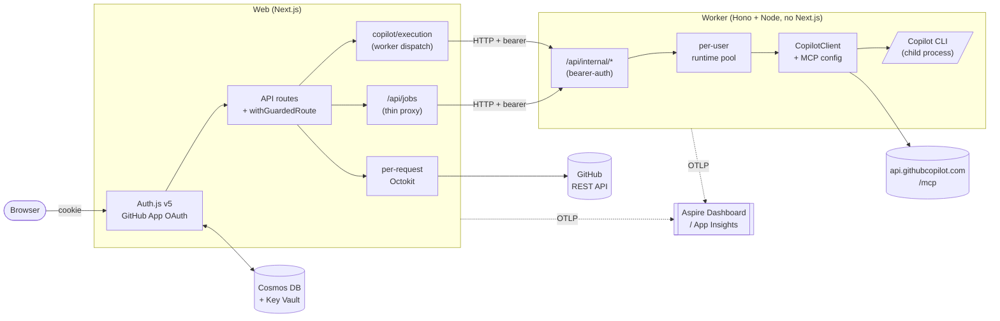
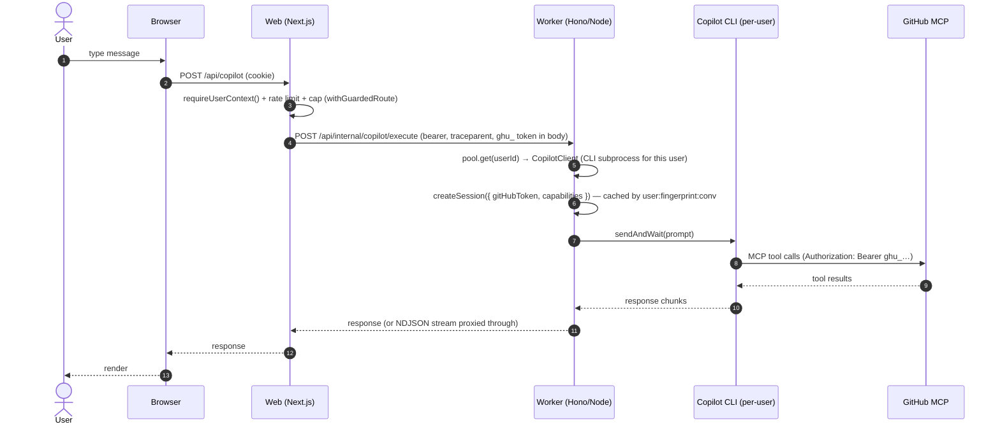
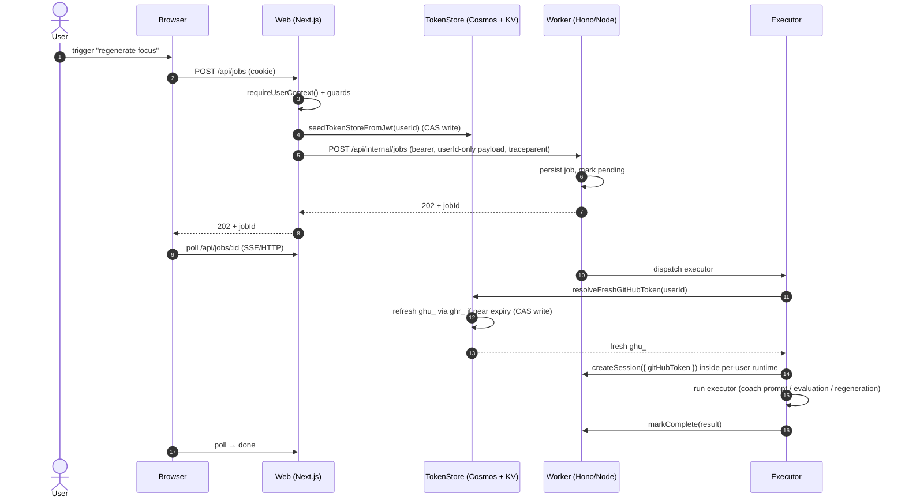
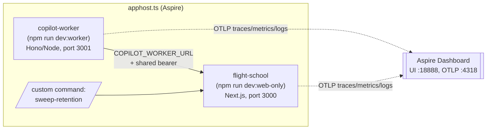
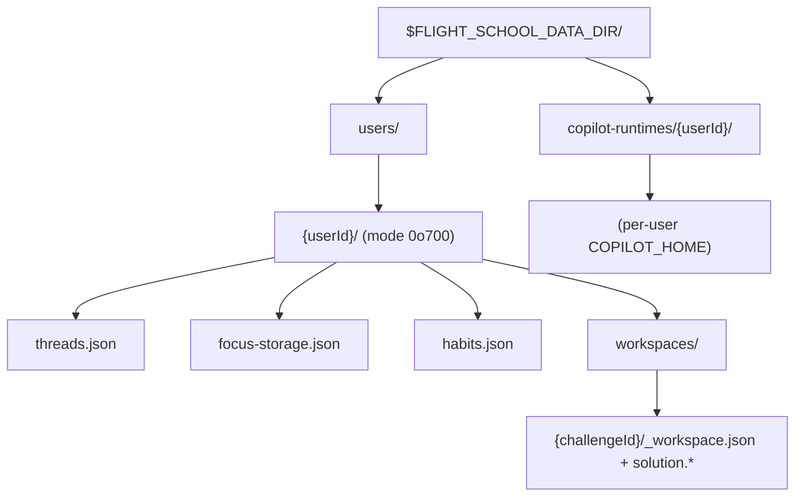
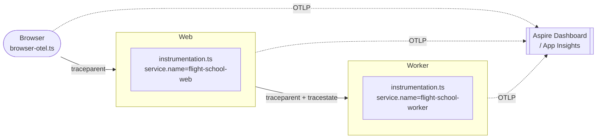

# Flight School Architecture

> [!WARNING]
> **Exploratory project — not a reference architecture.** Flight School is a
> single-developer experiment. This document describes the current shape of
> the system, the decisions that produced it, and where to find the code.
> It is *not* general guidance for building production systems.

This is the **story** of Flight School: what it is, how it's shaped, why
it's shaped that way, and where to look in the code when you want to go
deeper. If you only read one architecture doc in this repo, read this one.
For the threat-model-grade reference, follow the links into
[`architecture-multitenant.md`](architecture-multitenant.md) and its
neighbours.

## What Flight School is

Flight School is a multi-tenant Next.js app that turns a developer's
GitHub activity into a personalised learning loop — daily focus, coding
challenges, real-time AI evaluation, hints, and a coaching chat. The
heavy lifting is done by the [GitHub Copilot SDK](https://github.com/github/copilot-sdk),
which spawns a Copilot CLI subprocess per session and gives that
subprocess access to GitHub's [Remote MCP server](https://github.com/github/github-mcp-server).

Two processes do the work:

- A **web** Next.js app handles browser traffic, OAuth, and per-user data.
- A **worker** standalone Node process (Hono + `@hono/node-server`, no
  Next.js framework) is the *only* place the Copilot SDK ever runs.
  See [decision 2](#2-the-copilot-sdk-runs-in-a-separate-worker-process).

Everything else flows from that split.

## System at a glance

Browsers only ever talk to Web. Web only ever talks to Worker over an
internal HTTP boundary protected by a bearer secret. Worker is the only
process that imports `@github/copilot-sdk` or spawns the Copilot CLI.

## The five decisions that shape everything

Every odd shape in the codebase traces back to one of these.

### 1. Multi-tenant by construction

There is **no ambient identity**. Every request is authenticated as a
specific GitHub user via Auth.js v5 + a GitHub App OAuth flow, and that
user's user-to-server (`ghu_`) token is what GitHub API calls — and
Copilot SDK sessions — use. No `process.env.GITHUB_TOKEN`, no
`gh auth token` fallback, no module-scope Octokit. Local dev signs in
through the same flow as production.

| Concern | Implementation |
| --- | --- |
| OAuth provider config + session/JWT callbacks | [`src/lib/auth/config.ts`](../src/lib/auth/config.ts) |
| Resolve the caller in handlers | [`src/lib/auth/context.ts`](../src/lib/auth/context.ts) → `requireUserContext`, `getUserContext` |
| Per-request Octokit factory | [`src/lib/github/client.ts`](../src/lib/github/client.ts) → `getOctokitForRequest` |
| Route guard (auth + rate limit + cap + audit) | [`src/lib/security/guard.ts`](../src/lib/security/guard.ts) → `withGuardedRoute` |
| Per-user abuse controls | [`src/lib/security/rate-limit.ts`](../src/lib/security/rate-limit.ts), [`session-cap.ts`](../src/lib/security/session-cap.ts), [`audit.ts`](../src/lib/security/audit.ts) |

### 2. The Copilot SDK runs in a separate worker process

The SDK spawns long-lived Copilot CLI subprocesses, holds per-session
state in `COPILOT_HOME`, and bills against the calling user's Copilot
entitlement. Mixing that with the public web tier would mean every web
replica owned per-user CLI state, and a crash would take browser traffic
down with it.

So we split it: **Web dispatches; Worker executes.** The worker is a
**standalone Node process** (Hono + `@hono/node-server`) — *not* a
Next.js app. Web has no `next/*` import reachable from the worker
entrypoint; the CI gate
[`scripts/check-worker-next-free.mjs`](../scripts/check-worker-next-free.mjs)
fails the build if any leak appears. If `COPILOT_WORKER_URL` is unset,
web AI routes fail fast with a typed `CopilotWorkerRequiredError`.

| Concern | Implementation |
| --- | --- |
| Web-side dispatch primitives (the only sanctioned SDK entry points from web) | [`src/lib/copilot/execution/`](../src/lib/copilot/execution/) → `executeCopilotChat`, `executeCopilotCoachJob`, `openCopilotAuthoringStreamViaWorker` |
| Worker-required failure mode | [`src/lib/copilot/execution/worker-required-error.ts`](../src/lib/copilot/execution/worker-required-error.ts) |
| Worker entrypoint (Node) | [`src/worker/bootstrap.ts`](../src/worker/bootstrap.ts) → `src/worker/server-main.ts` (`runWorker()`) |
| Hono app + routes (bearer-auth) | [`src/worker/http/app.ts`](../src/worker/http/app.ts), handlers under [`src/worker/http/handlers/`](../src/worker/http/handlers/) |
| Worker lifecycle (OTel, warmup, restart-sweep, shutdown) | [`src/worker/lifecycle/`](../src/worker/lifecycle/) |
| Session + MCP factories (worker-only) | [`src/lib/copilot/sessions.ts`](../src/lib/copilot/sessions.ts), [`server.ts`](../src/lib/copilot/server.ts), [`mcp.ts`](../src/lib/copilot/mcp.ts) |
| Boundary guards (CI) | [`scripts/check-copilot-sdk-boundary.mjs`](../scripts/check-copilot-sdk-boundary.mjs), [`scripts/check-worker-next-free.mjs`](../scripts/check-worker-next-free.mjs) |
| Build / image | [`scripts/build-worker.mjs`](../scripts/build-worker.mjs) + [`Dockerfile.worker`](../Dockerfile.worker) — esbuild bundles to `dist-worker/*.mjs`; runtime image only carries the externalised native packages (`@github/copilot`, OTel SDK, `@hono/node-server`, `@azure/cosmos`, …). |

### 3. One Copilot runtime per user, pooled and evicted

Inside the worker, each authenticated user gets their **own**
`CopilotClient`, their own Copilot CLI child process, and their own
`COPILOT_HOME` directory. A pool with idle TTL + a max-active cap keeps
this bounded; an LRU evicts cold tenants.

The session cache key inside that runtime is
`${userId}:${capabilityFingerprint}:${conversationId}`, so two users
sharing a `conversationId` never share an SDK session and two requests
with different capabilities never share a CLI process.

| Concern | Implementation |
| --- | --- |
| Per-user runtime pool | [`src/lib/copilot/runtime/per-user-pool.ts`](../src/lib/copilot/runtime/per-user-pool.ts) |
| Single user's runtime (CLI process + `COPILOT_HOME`) | [`src/lib/copilot/runtime/user-runtime.ts`](../src/lib/copilot/runtime/user-runtime.ts), [`user-home.ts`](../src/lib/copilot/runtime/user-home.ts) |
| Capability fingerprint (cache key) | [`src/lib/copilot/fingerprint.ts`](../src/lib/copilot/fingerprint.ts) |
| Per-conversation capability memory (monotonic-add) | [`src/lib/copilot/conversation-capabilities.ts`](../src/lib/copilot/conversation-capabilities.ts) |

Tuning knobs (env, defaults in [`runtime/config.ts`](../src/lib/copilot/runtime/config.ts)):

| Env | Default | Purpose |
| --- | --- | --- |
| `COPILOT_RUNTIME_IDLE_TTL_MS` | `600000` | Evict idle runtimes after 10 min. |
| `COPILOT_RUNTIME_MAX_ACTIVE` | `3` | Concurrent active per-user runtimes. |
| `COPILOT_RUNTIME_HOME_ROOT` | `$FLIGHT_SCHOOL_DATA_DIR/copilot-runtimes` | Root for per-user `COPILOT_HOME`. |

### 4. Background jobs carry userId only and refresh at execution

AI work (focus regeneration, evaluation, chat responses, hints) can
outlive the HTTP request that submitted it. GitHub user-to-server tokens
live ~8 hours, so embedding the request-time token on a queued job is
unsafe.

Instead, persisted job records carry **only** the `userId` plus the
job-specific input. The executor resolves a fresh token from the token
store at run time, refreshing it via `ghr_` if needed. Before
enqueueing, the API route seeds the token store from the encrypted JWT
cookie (a no-op if Cosmos already has fresher material thanks to the
CAS-write contract).

Web and worker traces are stitched with W3C trace context
(`traceparent` / `tracestate`) on every dispatch, so a single chat or
job flow shows up as one distributed trace.

| Concern | Implementation |
| --- | --- |
| Enqueue (web → worker proxy) | [`src/app/api/jobs/route.ts`](../src/app/api/jobs/route.ts) |
| Pre-enqueue token seed | [`src/lib/auth/seed.ts`](../src/lib/auth/seed.ts) → `seedTokenStoreFromJwt` |
| Worker-side create/dispatch | [`src/worker/http/handlers/jobs.ts`](../src/worker/http/handlers/jobs.ts), [`jobs-by-id.ts`](../src/worker/http/handlers/jobs-by-id.ts), [`jobs-stream.ts`](../src/worker/http/handlers/jobs-stream.ts) |
| Executors (one per job type) | [`src/worker/jobs/executors/`](../src/worker/jobs/executors/) |
| Token resolver (refresh-on-execute) | [`src/lib/auth/token-resolver.ts`](../src/lib/auth/token-resolver.ts) |
| Scheduler + retention sweeps | [`src/worker/jobs/scheduler.ts`](../src/worker/jobs/scheduler.ts), [`retention.ts`](../src/worker/jobs/retention.ts) |
| Cross-process trace propagation | [`src/lib/observability/context-propagation.ts`](../src/lib/observability/context-propagation.ts) |

> The deeper invariants — *payload never contains a token*, *executors
> never retry on a credential failure*, *trace context replay through
> span links* — live in
> [`architecture-multitenant.md#background-jobs`](architecture-multitenant.md#background-jobs).

### 5. Tokens encrypted at rest with a Cosmos + Key Vault envelope

In production the `TokenStore` is backed by Cosmos DB. Each document
holds an AES-256-GCM-encrypted token blob; the per-document DEK is
wrapped with a Key Vault key (KEK) via `A256KW` using
`DefaultAzureCredential` (managed identity in ACA). AES-GCM AAD binds
the ciphertext to `{alg, expiresAt, kekId, userId}` so a stolen envelope
can't be replayed into another user, another KEK, or an extended TTL —
any mismatch throws at `decipher.final()`.

Writes use Cosmos optimistic concurrency (`setTokenIfNewer`, CAS on
`_etag`) so the JWT-callback refresh, the pre-enqueue seed, and the
executor-time refresh never clobber each other. A bounded LRU+TTL DEK
cache keeps the steady-state read path off Key Vault.

| Concern | Implementation |
| --- | --- |
| Store abstraction + factory | [`src/lib/auth/token-store.ts`](../src/lib/auth/token-store.ts) |
| Cosmos implementation (encryption, CAS, DEK cache) | [`src/lib/auth/token-store/`](../src/lib/auth/token-store/) |
| Tokens never appear on `session.*` | [`src/lib/auth/config.ts`](../src/lib/auth/config.ts) (session callback), [`next-auth.d.ts`](../src/lib/auth/next-auth.d.ts) |

In local dev (`AZURE_COSMOS_ENDPOINT` unset) the factory falls back to
an in-memory map. In `NODE_ENV=production` it **throws on boot** if
Cosmos is unconfigured, so the in-memory store can't be deployed by
accident.

## Auth & tokens: the full landscape

The five decisions above each touch a piece of the auth story. This
section pulls them into one place so the question *"which token does
what, where does it live, and what can I actually change?"* has a
single answer.

### How a token flows through one request

1. **Sign in.** GitHub issues a user-to-server access token (`ghu_`,
   8 hours) and a refresh token (`ghr_`, ~6 months). Auth.js wraps
   both inside an encrypted JWE cookie that only the server can
   decrypt. Flight School *also* writes encrypted copies into Cosmos
   so background work can refresh without the cookie ([decision 5](#5-tokens-encrypted-at-rest-with-a-cosmos--key-vault-envelope)).
2. **Each web request.** The Next.js process reads the JWE cookie,
   decrypts it server-side, and constructs a per-request Octokit
   bound to that user's `ghu_`. For any Copilot SDK work, the web
   process **dispatches `ghu_` over the internal RPC to the worker**
   — the SDK is never instantiated in web ([decision 2](#2-the-copilot-sdk-runs-in-a-separate-worker-process)).
   Nothing user-scoped is process-wide.
3. **In the worker.** The worker receives `identity.gitHubToken`
   (`ghu_`) in the RPC body, looks up / refreshes the Cosmos-backed
   copy if it's running a background job (using `ghr_` if within
   ~5 minutes of expiry — see
   [`REFRESH_LEEWAY_MS`](../src/lib/auth/token-resolver.ts)), and
   constructs the per-user Copilot SDK session passing
   `SessionOptions.gitHubToken`. The SDK lives only in the worker.
4. **After 8 hours.** GitHub rejects the old `ghu_`. A refresh
   exchanges `ghr_` → new `(ghu_, ghr_)`; **GitHub invalidates the
   old `ghu_` *and* the old `ghr_` at that moment**. So while the
   8-hour ceiling on a given access token is fixed by GitHub, every
   refresh shortens the practical lifetime of the previous one.

### Tokens in play

> **Storage vs authority.** Cosmos and the JWE cookie hold *copies*
> of GitHub-issued tokens. **GitHub alone decides whether a `ghu_`
> or `ghr_` is still accepted.** Deleting a local copy doesn't
> revoke at GitHub; performing a refresh rotates at GitHub. Treat
> the Cosmos copy as cached state, not source of truth.

| Token | Issued by | Lifetime | At rest | In transit / used at | Authority on validity |
| --- | --- | --- | --- | --- | --- |
| **Auth.js session cookie** (JWE) | Flight School (`AUTH_SECRET`) | Auth.js framework default 30d (unset in [`auth/config.ts`](../src/lib/auth/config.ts) — one config line away from changing) | Browser cookie (`httpOnly`, `Secure`, `SameSite=Lax`) | Every request from the browser | Flight School (we sign + encrypt) |
| **GitHub user-to-server access token** (`ghu_`) | GitHub | **8 hours, fixed by GitHub** | Encrypted in Cosmos `TokenStore` **and** inside the JWE cookie payload | Web→worker RPC body (`identity.gitHubToken`); SDK `SessionOptions.gitHubToken`; Octokit `Authorization: Bearer`; process memory while a request is in flight | GitHub (`/user` returns 401 on expiry / refresh) |
| **GitHub refresh token** (`ghr_`) | GitHub | ~6 months (GitHub platform doc; not currently re-validated in code — we drop `refresh_token_expires_in`) | Encrypted in Cosmos **and** inside the JWE cookie payload | (1) OAuth refresh round-trip to GitHub; (2) web→worker job-dispatch payload — `buildWorkerDispatchCredentials` in [`src/lib/auth/seed.ts`](../src/lib/auth/seed.ts) ships `credentials.refreshToken` so background jobs can self-refresh | GitHub (single-use; old `ghr_` dies the moment a refresh succeeds) |
| **GitHub App installation token** | GitHub (signed by App private key) | ≤ 1 hour | Not stored — currently unused at runtime | — | — |
| **`COPILOT_WORKER_SECRET`** (shared bearer) | Flight School (env / Key Vault) | Until rotated / redeployed (each process reads it once at startup) | Env on web + worker | Every web→worker call as `Authorization: Bearer …` | Flight School |
| **Copilot CLI internal token** | Copilot SDK (opaque; SDK-managed; we don't model it) | SDK-managed | Per-user `COPILOT_HOME` directory on the worker | — | Copilot SDK |

### Levers worth knowing about

Most rows below are *possible* changes, not active configuration.
Each names the exact constant + file so a future reader can find
the surface area in seconds.

| Lever | Acts on | Effect | Cost / honest caveat |
| --- | --- | --- | --- |
| Idle-sweep stored `ghu_` after 1–2h of no use | Cosmos copy of `ghu_` (and how `ghr_` is retained — see caveat) | Shrinks the window during which a stolen Cosmos envelope is useful. Requires a design choice: (a) split storage so `ghu_` and `ghr_` are separate documents and only the access token is swept (background jobs continue to refresh transparently), or (b) sweep the whole record and rely on the next web request to re-seed from the JWE cookie (background jobs cannot self-recover until that happens). Option (a) is preferred for background-job resilience. | **Currently blocked.** [`cleanupExpired()` in `src/lib/auth/token-store/cosmos.ts`](../src/lib/auth/token-store/cosmos.ts) is a `return 0` no-op because we drop GitHub's `refresh_token_expires_in` in `github-oauth.ts`. Fix path: plumb that field through, introduce split storage per (a), then sweep where `accessExpiresAt < now − idleGrace` while `refreshExpiresAt` is still valid. |
| Shorten `REFRESH_LEEWAY_MS` (currently 5 min, [`src/lib/auth/token-resolver.ts`](../src/lib/auth/token-resolver.ts)) — Cosmos-backed server-side path | Triggers the `ghr_ → ghu_` exchange earlier in **background-job / server-side** flow | Rotates earlier; **does** narrow the practical lifetime of the previous `ghu_` because the refresh invalidates it at GitHub. | Extra GitHub calls + Cosmos writes. |
| Shorten `REFRESH_BUFFER_SECONDS` (currently 60s, [`src/lib/auth/config.ts`](../src/lib/auth/config.ts)) — Auth.js JWT-callback path | Same idea, different code path (request-time JWT refresh) | Same effect, different surface. | Same cost. |
| Always refresh per request (set leeway → 8h) | `ghu_` everywhere | Every request gets a fresh `ghu_`; the previous one dies immediately at GitHub. | KV unwrap + GitHub round-trip per request. Real but expensive. |
| Shorten Auth.js cookie `maxAge` | Session cookie | Forces user re-auth sooner. Narrows browser-side risk window. | UX cost. Doesn't affect server-stored tokens. |
| Drop scopes on the GitHub App | What `ghu_` can do | Reduces blast radius if a token leaks. **Highest leverage available today.** | One-time scope review. |
| Ensure sign-out calls `TokenStore.deleteToken` | Cosmos copy of `ghu_` + `ghr_` | Immediate server-side revocation of our local copy on explicit sign-out. | Small audit + code change. |

**One-line takeaway:** *GitHub fixes the `ghu_` ceiling at 8 hours.
The real wins are scope minimisation and shrinking how long **our
copy** persists in Cosmos beyond actual use.*

For the deeper invariants — payload-never-contains-token, executors
never retry on a credential failure, the CAS write contract — see
[`architecture-multitenant.md#token-storage`](architecture-multitenant.md#token-storage).

## A chat turn, end-to-end

Key things this diagram is making true:

- The web tier carries the user's `ghu_` token in the dispatch body, never
  in a job payload or shared cache.
- The worker pool, not web, owns CLI process lifecycle.
- Streaming routes (challenge evaluation, chat, authoring) get the same
  treatment — the worker emits NDJSON/SSE, the web tier pipes it back.

## A background job, end-to-end

The pattern repeats for every job type — chat responses, challenge
evaluation, topic / challenge / goal regeneration, guided plans. The
executor list lives in [`src/worker/jobs/executors/`](../src/worker/jobs/executors/);
the dispatch table is in
[`src/worker/jobs/executor-dispatcher.ts`](../src/worker/jobs/executor-dispatcher.ts).

## Running it locally (Aspire AppHost)

Local dev mirrors the production shape: a Next.js web process and a
standalone Node (Hono) worker process talking to each other over HTTP,
plus an OTLP-receiving dashboard. The TypeScript Aspire AppHost wires
it together.

What each script actually does:

| Command | What it starts | When to use |
| --- | --- | --- |
| `npm run dev` (alias `npm run aspire:run`) | AppHost → web on `:3000` + worker on `:3001` + dashboard wiring. | **Default.** Mirrors prod shape; AI features work. |
| `npm run dev:web-only` | Just Next.js web on `:3000`, no worker. | UI work that doesn't exercise Copilot chat. AI routes intentionally fail fast. |
| `npm run dev:worker` | Just the Hono worker on `:3001` (`tsx watch src/worker/bootstrap.ts`). | Combine with `dev:web-worker` to debug the worker in isolation. |
| `npm run dev:web-worker` | Web on `:3000` pointed at a manually started local worker. | Two-terminal debug flow. |
| `npm run build:worker` | Bundles the worker to `dist-worker/*.mjs` via esbuild + writes a minimal runtime `package.json`. | Container build (consumed by `Dockerfile.worker`). |
| `npm run start:worker` | Runs the bundled worker (`node dist-worker/bootstrap.mjs`). | Local production-shape check. |
| `npm run dashboard` | Standalone Aspire Dashboard (anonymous). | Inspect telemetry from any of the above. |

AppHost wiring (read alongside the code):

- The resource graph is declared in [`apphost.ts`](../apphost.ts).
  Until Aspire's JavaScript hosting integration grows a first-class
  `addNodeApp`/`addDockerfile` primitive, the worker is still declared
  via `addNextJsApp` pointed at `runScriptName: 'dev:worker'` for
  **local dev only**. The deployed container is Next-free (built from
  [`Dockerfile.worker`](../Dockerfile.worker) over `dist-worker/`),
  so the cosmetic mismatch never leaves your laptop.
- The worker resource sets a shared `COPILOT_WORKER_SECRET` and a
  distinct `OTEL_SERVICE_NAME=flight-school-worker` so the dashboard
  can tell the two processes apart.
- The web resource resolves the worker's URL via
  `workerEndpoint.property(EndpointProperty.Url)` and injects it as
  `COPILOT_WORKER_URL`. `OTEL_SERVICE_NAME=flight-school-web` and
  `CRON_SKIP_AUTH=1` are set here too.
- A custom dashboard command `sweep-retention` POSTs to
  `/api/cron/sweep` so you can exercise retention without a cron tick.
- Aspire's `.modules/` runtime helpers are generated by
  `aspire init --language typescript` and are intentionally not
  committed.
- Agent-driven debugging: `npm run aspire:mcp` exposes traces/logs to a
  coding agent — see
  [`.github/skills/aspire-debugging/SKILL.md`](../.github/skills/aspire-debugging/SKILL.md).

Local data (chat threads, focus, workspaces) lives outside the repo so
you can't accidentally commit it:

- macOS / Linux: `~/.local/share/flight-school/`
- Windows: `%LOCALAPPDATA%\flight-school\`
- Override with `FLIGHT_SCHOOL_DATA_DIR`.

## Storage layout

Per-user data is partitioned on disk and in Cosmos. The same primitive
(`resolveUserScopedPath`) is shared by the storage-route factory and the
RSC data loaders, so API and Server Component paths can't drift.

| Concern | Implementation |
| --- | --- |
| Path resolution + validation (rejects `..`, `/`, etc.) | [`src/lib/storage/user-scope.ts`](../src/lib/storage/user-scope.ts), [`user-storage.ts`](../src/lib/storage/user-storage.ts) |
| Shared storage-route factory | [`src/lib/api/storage-route-factory.ts`](../src/lib/api/storage-route-factory.ts) |
| Per-user storage routes | [`src/app/api/threads/storage/`](../src/app/api/threads/storage/), [`focus/storage/`](../src/app/api/focus/storage/), [`workspace/storage/`](../src/app/api/workspace/storage/) |
| Retention sweeps (cron) | [`src/lib/storage/user-retention.ts`](../src/lib/storage/user-retention.ts), [`src/app/api/cron/sweep/`](../src/app/api/cron/sweep/) |
| Token store (Cosmos + Key Vault) | [`src/lib/auth/token-store/`](../src/lib/auth/token-store/) |

`{userId}` is the numeric GitHub user ID from the Auth.js session —
never from a query string or request body. Anything that doesn't match
`/^[a-zA-Z0-9_-]+$/` is rejected with HTTP 400 before any filesystem
call. See
[`architecture-multitenant.md#storage-isolation`](architecture-multitenant.md#storage-isolation)
for the full invariant list and migration notes.

## Observability

OpenTelemetry is registered via `@vercel/otel` on both processes; the
two emit OTLP to the Aspire Dashboard locally and to App Insights in
ACA.

Hot paths in the code:

| Concern | Implementation |
| --- | --- |
| Server-side OTel bootstrap (both processes) | [`src/instrumentation.ts`](../src/instrumentation.ts) |
| Browser OTel bootstrap | [`src/lib/observability/browser-otel.ts`](../src/lib/observability/browser-otel.ts) |
| Cross-process trace context capture / inject | [`src/lib/observability/context-propagation.ts`](../src/lib/observability/context-propagation.ts) |
| GenAI semantic conventions (span/metric names, buckets) | [`src/lib/observability/semconv.ts`](../src/lib/observability/semconv.ts) |
| Hygiene sampler + bubble-filter exporter (drops Next.js self-spans) | [`src/lib/observability/proxy-sampler.ts`](../src/lib/observability/proxy-sampler.ts), [`bubble-filter-exporter.ts`](../src/lib/observability/bubble-filter-exporter.ts) |
| User-trigger metadata (button click → server span attrs) | [`src/lib/observability/trigger-metadata.ts`](../src/lib/observability/trigger-metadata.ts), [`job-trigger-builders.ts`](../src/lib/observability/job-trigger-builders.ts) |
| Route timing wrapper | [`src/lib/observability/route-tracking.ts`](../src/lib/observability/route-tracking.ts) |

A single chat or job flow lands in one trace because every dispatch
captures `traceparent` / `tracestate` and replays them on the worker
side. For replay scenarios (job retries) the worker links to the
original via OTel span links.

The OpenTelemetry skill is the operational deep dive:
[`.github/skills/opentelemetry/SKILL.md`](../.github/skills/opentelemetry/SKILL.md).

## Where to go next

| You want to… | Read |
| --- | --- |
| Deep dive on auth, tokens, CAS, DEK cache, AAD binding | [`docs/architecture-multitenant.md`](architecture-multitenant.md) |
| Understand why `infiniteSessions` stays on | [`docs/copilot-sdk-persistence.md`](copilot-sdk-persistence.md) |
| Deploy to (or operate) Azure Container Apps | [`docs/deployment-aca.md`](deployment-aca.md), [`infra/README.md`](../infra/README.md) |
| Upgrade an existing checkout to multi-tenant | [`docs/migrations/2025-multitenant-auth.md`](migrations/2025-multitenant-auth.md) |
| Add a new Copilot feature without breaking the worker boundary | [`.github/skills/copilot-sdk-worker-only/SKILL.md`](../.github/skills/copilot-sdk-worker-only/SKILL.md) |
| Instrument a new route / span / metric | [`.github/skills/opentelemetry/SKILL.md`](../.github/skills/opentelemetry/SKILL.md) |
| Debug something running under Aspire | [`.github/skills/aspire-debugging/SKILL.md`](../.github/skills/aspire-debugging/SKILL.md) |
| See the original design proposals | [`docs/superpowers/specs/`](superpowers/specs/), [`docs/superpowers/plans/`](superpowers/plans/) |

## Keeping this doc honest

If you change an architectural boundary (auth, worker dispatch, jobs,
storage, observability, Aspire resource graph), **this doc is in scope
by default** — it is the index that links everything else. The
[`doc-currency` skill](../.github/skills/doc-currency/SKILL.md) lists
the full set of authoritative docs to sweep before declaring a task
complete.
