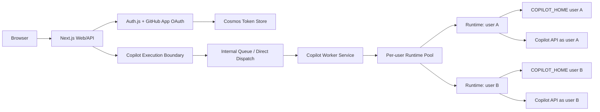

# Copilot Worker Pool Design

**Status**: Foundation Implemented
**Date**: 2026-05-22

## Resumption Section
- **Scope**: Document the target architecture for moving Flight School from a shared in-process Copilot runtime to an internal worker service with per-user runtime isolation.
- **Current Phase**: Foundation implemented.
- **Next Action**: Extract the in-process boundaries into an internal worker service when infrastructure work starts.
- **Blockers**: None.

## Job Story
When Flight School is offered to arbitrary GitHub users, we want AI work to run in an isolated per-user runtime boundary, so user tokens, session state, memory pressure, and runtime failures do not share one Copilot CLI process.

## Current State
- Flight School authenticates each request through Auth.js and a GitHub App OAuth flow.
- GitHub user-to-server tokens are resolved server-side and passed to Copilot SDK sessions as `gitHubToken`.
- The current SDK integration uses one singleton `CopilotClient` per Next.js process.
- The singleton client uses `useLoggedInUser: false`, so it does not inherit ambient `gh` or host identity.
- Conversation sessions are cached by `userId`, `poolKey`, and `conversationId`.
- MCP server config is rebuilt per call with the requesting user's token.
- This design gives identity isolation, but not Copilot CLI process isolation.

## Goals
1. Make the current shared-runtime limitation explicit in public markdown.
2. Define a worker boundary that lets web/API code stop owning Copilot runtime execution directly.
3. Support per-user Copilot runtime isolation as the target architecture.
4. Preserve GitHub App OAuth, token refresh, audit logging, and per-user abuse controls.
5. Keep an incremental path so the existing product can keep working while the runtime moves behind the worker boundary.

## Non-Goals
- Replacing Auth.js or the GitHub App OAuth model.
- Introducing shared sessions between users.
- Making Flight School production-ready in this spec alone.
- Selecting a final queue provider beyond the Azure-oriented direction already used by the repo.
- Shipping the full worker service or spawning isolated Copilot CLI processes.

## User Stories

### Must Have
- [ ] **S1**: As a maintainer, I want the README and architecture docs to state the current shared-runtime limitation, so readers do not mistake the exploratory implementation for production SaaS isolation.
  - AC1.1: README says current Copilot execution uses a shared in-process runtime per app process.
  - AC1.2: README distinguishes per-session identity isolation from per-user process isolation.
  - AC1.3: Architecture docs link the target worker-pool direction.

- [ ] **S2**: As an application developer, I want a stable execution boundary between routes and Copilot runtime work, so the web layer can later delegate to a worker without rewriting every route.
  - AC2.1: A future plan can introduce a `CopilotExecutionClient` or equivalent interface.
  - AC2.2: Existing route semantics remain unchanged while the first adapter stays in-process.
  - AC2.3: The boundary accepts user identity, operation metadata, prompt/input, and session/conversation identifiers without storing raw tokens in job payloads.

- [ ] **S3**: As an operator, I want AI work to run in an internal worker service, so web replicas can remain focused on auth, HTTP, and UI streaming while workers own Copilot lifecycle.
  - AC3.1: The worker resolves fresh user credentials at execution time.
  - AC3.2: The worker emits audit and telemetry events with hashed user IDs.
  - AC3.3: The web app can submit work synchronously for streaming paths or asynchronously for background paths.

- [ ] **S4**: As a platform owner, I want per-user runtime isolation, so one user's Copilot CLI process, session files, or crash does not share the same runtime boundary with another user.
  - AC4.1: The target pool keys runtimes by stable GitHub `userId`.
  - AC4.2: Each runtime has a user-specific `COPILOT_HOME` or equivalent session-state directory.
  - AC4.3: Runtime TTL, max active runtimes, health checks, and graceful eviction are explicit requirements.

### Should Have
- [ ] **S5**: As an operator, I want an incremental migration path, so public-beta safety improves without a large rewrite.
  - AC5.1: Phase 1 documents the limitation.
  - AC5.2: Phase 2 introduces an in-process execution adapter.
  - AC5.3: Phase 3 moves execution to an internal worker service.
  - AC5.4: Phase 4 adds per-user runtime pools inside the worker.

## Acceptance Criteria Summary
| ID | Criterion | Testable? | Story |
|----|-----------|-----------|-------|
| AC1.1 | README documents shared in-process runtime | Yes | S1 |
| AC1.2 | Docs distinguish identity isolation from process isolation | Yes | S1 |
| AC1.3 | Architecture docs link worker-pool direction | Yes | S1 |
| AC2.1 | Plan can add execution boundary | Yes | S2 |
| AC2.2 | Existing route semantics preserved during adapter phase | Yes | S2 |
| AC2.3 | Job payloads stay token-free | Yes | S2 |
| AC3.1 | Worker resolves fresh credentials at execution time | Yes | S3 |
| AC3.2 | Worker emits audit/telemetry with hashed user IDs | Yes | S3 |
| AC3.3 | Sync and async execution paths are supported | Yes | S3 |
| AC4.1 | Runtime pool keys by userId | Yes | S4 |
| AC4.2 | Runtime has user-specific session-state directory | Yes | S4 |
| AC4.3 | Runtime lifecycle controls are explicit | Yes | S4 |
| AC5.1-5.4 | Migration phases are documented | Yes | S5 |

## Design Decisions
| ID | Decision | Rationale |
|----|----------|-----------|
| DD1 | Target an internal worker service before full per-user runtime isolation | Creates a clean boundary first and avoids a high-risk rewrite. |
| DD2 | Treat per-user runtime pools as the production-oriented end state | It aligns with Copilot SDK scaling guidance for stronger multi-tenant isolation. |
| DD3 | Keep GitHub App OAuth and token refresh as the identity source | The current auth model already provides per-user `ghu_` tokens and refresh semantics. |
| DD4 | Keep queued job payloads token-free | Existing security guarantees remain valid when work moves out of process. |
| DD5 | Preserve an in-process adapter as the first implementation step | It lets tests and routes migrate to the new boundary before infrastructure changes. |

## Target Architecture

## Operational Requirements
- Runtimes are private to the internal network and never exposed publicly.
- Worker resolves a fresh token from the token store immediately before execution.
- Worker rejects work if credentials are missing, expired, or unrefreshable.
- Runtime pool enforces max active runtimes and idle TTL.
- User runtime eviction gracefully disconnects sessions and clears in-memory handles.
- Runtime crashes are scoped to the owning user and surface as retryable or re-auth-required job failures.
- Telemetry captures runtime start, reuse, eviction, crash, session create, and send durations.

## Foundation Implemented
- `src/lib/copilot/execution/` routes chat through an execution boundary while preserving current in-process SDK behavior.
- `src/app/api/jobs/dispatcher.ts` moves background-job executor routing behind a dispatch boundary while keeping job payloads token-free.
- `src/lib/copilot/runtime/` defines prototype per-user runtime-pool contracts with user-keyed reuse, idle TTL eviction, capacity eviction, and lifecycle events.

## Specialist Sign-Off
| Specialist | Status | Notes |
|------------|--------|-------|
| Architecture | approve | Worker boundary before runtime isolation reduces migration risk. |
| Security | approve | Per-user runtime state improves on current identity-only isolation. |
| Operations | concern | Runtime pool sizing, TTL, and queue semantics must be validated before public launch. |

### Key Specialist Recommendations
- **Architecture**: Introduce the execution interface before moving infrastructure.
- **Security**: Keep job payloads token-free and resolve credentials only inside trusted server/worker code.
- **Operations**: Treat per-user runtime pool limits and telemetry as first-class requirements.

## Handoff for Planning
- **Affected Domains**: [x] Test [ ] E2E [ ] Accessibility [x] Performance [x] Code Quality [x] Technical Writing [x] Code Documentation
- **Migration Strategy**: Indirection first, then worker extraction, then per-user runtime isolation.
- **Files**: `README.md`, `docs/architecture-multitenant.md`, `docs/deployment-aca.md`, `src/lib/copilot/*`, `src/app/api/*`, `src/app/api/jobs/*`, `infra/*`, future worker service files.
- **Risks**: The installed SDK currently supports per-session `gitHubToken`, but external `cliUrl` plus client-level token behavior may differ across SDK versions. Verify SDK behavior in a spike before relying on external CLI authentication.
