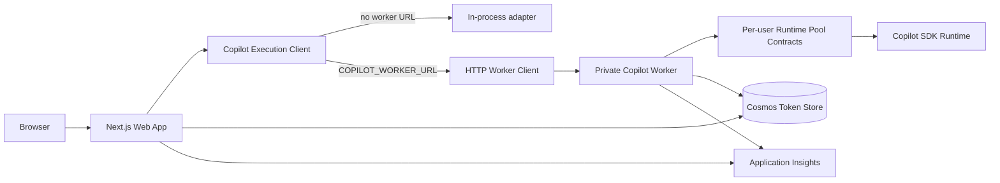

# Copilot Worker Service Foundation Design

**Status**: Foundation Implemented
**Date**: 2026-05-22

## Resumption Section
- **Scope**: Add a local Copilot worker service path and production deployment scaffold while preserving the current in-process fallback.
- **Current Phase**: Foundation implemented.
- **Next Action**: Validate local worker behavior manually with real GitHub OAuth credentials, then plan durable async worker migration.
- **Blockers**: None.

## Job Story
When developing or deploying Flight School as a public multi-user platform, we want Copilot execution to be callable through a worker boundary, so local development can exercise process separation and production infrastructure can evolve toward isolated worker runtimes without another route rewrite.

## Current State
- `/api/copilot` delegates to `src/lib/copilot/execution/`, but the adapter still runs in the web process.
- `/api/jobs` delegates to `src/app/api/jobs/dispatcher.ts`, but the dispatcher still schedules in-process work.
- `src/lib/copilot/runtime/` contains tested per-user runtime-pool contracts, but no actual worker owns those runtimes yet.
- Aspire starts one Next.js app locally.
- Bicep deploys one external Container App plus a scheduled cron ACA Job.
- Token storage and refresh already support server-side credential resolution without queueing raw GitHub tokens.

## Goals
1. Add a local worker service path that runs out-of-process over HTTP.
2. Keep the web app working without a worker by falling back to the in-process adapter.
3. Add a stable worker protocol for chat execution first.
4. Scaffold production infrastructure for a private ACA worker app.
5. Document the future queue-backed async path without forcing it into this slice.

## Non-Goals
- Replacing every background job with Service Bus in this slice.
- Spawning separate Copilot CLI processes per user in production immediately.
- Removing the in-process fallback.
- Exposing the worker publicly.
- Changing GitHub OAuth, token storage, or public session shape.

## Approaches Considered
| Option | Summary | Pros | Cons | Decision |
|---|---|---|---|---|
| A | Separate local HTTP worker process plus private ACA worker scaffold | Exercises real process boundary locally; closest to production; preserves web fallback | More moving parts than in-process only | **Chosen** |
| B | In-process simulation only | Smallest code change; easiest tests | Does not prove local process separation; weak production confidence | Rejected |
| C | Full Service Bus + worker migration now | Closest to final architecture | Too large; risks mixing sync chat, async jobs, infra, and worker runtime concerns | Deferred |

## User Stories

### Must Have
- [ ] **S1**: As a developer, I can run the web app and worker locally, so I can test the worker boundary before deploying.
  - AC1.1: A documented script or Aspire command starts a local worker.
  - AC1.2: The web app can call the worker via a configurable internal URL.
  - AC1.3: If no worker URL is configured, current in-process behavior remains available.

- [ ] **S2**: As an application developer, I want a typed worker protocol, so the web process and worker process agree on request and response shape.
  - AC2.1: The protocol reuses `CopilotChatExecutionRequest` and `CopilotChatExecutionResult`.
  - AC2.2: Worker requests include the authenticated user identity only inside trusted server-to-worker calls.
  - AC2.3: Invalid worker requests fail explicitly with a non-success response.

- [ ] **S3**: As an operator, I want production scaffold for a private worker app, so the infrastructure can deploy the worker separately from the public web app.
  - AC3.1: Bicep defines a second Container App for the worker.
  - AC3.2: Worker ingress is internal-only or otherwise not publicly exposed.
  - AC3.3: Web app receives a worker base URL env var when the worker is enabled.
  - AC3.4: Worker has access to the same Key Vault/Cosmos/App Insights configuration needed for trusted execution.

- [ ] **S4**: As a maintainer, I want clear docs, so contributors know what is local, scaffolded, and still future work.
  - AC4.1: README or ACA docs describe local worker startup.
  - AC4.2: Architecture docs show web-to-worker flow.
  - AC4.3: Docs explicitly state Service Bus async execution remains deferred.

### Should Have
- [ ] **S5**: As a future implementer, I want queue/resource placeholders isolated, so Service Bus can be added without changing the chat worker protocol.
  - AC5.1: The design names the future queue boundary.
  - AC5.2: The implementation plan keeps queue work as a later task unless trivial scaffold is low-risk.

## Acceptance Criteria Summary
| ID | Criterion | Testable? | Story |
|---|---|---|---|
| AC1.1 | Local worker command documented | Yes | S1 |
| AC1.2 | Web app calls configurable worker URL | Yes | S1 |
| AC1.3 | In-process fallback remains | Yes | S1 |
| AC2.1 | Typed protocol reuses execution types | Yes | S2 |
| AC2.2 | Identity stays server-to-worker only | Yes | S2 |
| AC2.3 | Invalid requests fail explicitly | Yes | S2 |
| AC3.1 | Private worker Container App scaffold exists | Yes | S3 |
| AC3.2 | Worker not publicly exposed | Yes | S3 |
| AC3.3 | Web app has worker URL env var | Yes | S3 |
| AC3.4 | Worker gets required secret/config refs | Yes | S3 |
| AC4.1-4.3 | Local/prod/deferred docs updated | Yes | S4 |
| AC5.1-5.2 | Future queue boundary remains separate | Yes | S5 |

## Design Decisions
| ID | Decision | Rationale |
|---|---|---|
| DD1 | Use HTTP for the first worker transport | It works locally, maps to ACA internal ingress, and keeps the web boundary simple. |
| DD2 | Keep in-process fallback | Local setup and tests remain simple; production can opt in via env. |
| DD3 | Start with chat execution only | `/api/copilot` already has the cleanest execution boundary and is easiest to verify end-to-end. |
| DD4 | Deploy worker as a second ACA Container App from the same image | Avoids a second image pipeline while establishing separate process/runtime ownership. |
| DD5 | Defer Service Bus execution migration | Durable async work is important but should not block validating the local worker path. |

## Target Architecture

## Local Developer Experience
- Default `npm run dev` keeps current behavior.
- New worker command starts a local HTTP worker on a separate port.
- Setting `COPILOT_WORKER_URL=http://localhost:<worker-port>` makes the web process call the worker for chat execution.
- Aspire should start both resources and inject the worker URL into the web app when practical.
- Local worker should reuse existing Auth.js/token-store assumptions and avoid browser-accessible token exposure.

## Production Scaffold
- Add a private worker Container App module or parameterized reuse of the existing Container App module.
- Worker app uses the same image and a worker-specific command/env role.
- Worker ingress should be internal and not internet-exposed.
- Web app receives `COPILOT_WORKER_URL` pointing to the worker's internal ACA FQDN.
- Worker receives `AUTH_SECRET`, token-store config, Key Vault URI/name, and App Insights config.
- Keep the current public web app as the only external ingress.

## Error Handling
- If `COPILOT_WORKER_URL` is unset, use the in-process adapter.
- If the worker returns a non-2xx response, surface an explicit upstream worker error through existing route error handling.
- Worker HTTP calls use a configurable timeout and propagate abort signals where available.
- If the worker is unreachable, do not silently fall back in production; local fallback should be opt-in by leaving the worker URL unset.
- Invalid worker request payloads return a generic 400 and should not create Copilot sessions or echo request bodies.

## Testing Strategy
- Unit test worker protocol parsing and failure responses.
- Unit test execution client selection: worker URL set vs unset.
- Unit test middleware allows `/api/internal/*` through to the route-specific bearer-secret gate.
- Unit test worker client timeout/abort handling.
- Route tests continue to assert `/api/copilot` delegates through the execution boundary.
- Infra validation runs `az bicep build --file infra/main.bicep --stdout >/dev/null`.
- Final gate remains TypeScript, lint, Vitest, build, and maintainability checks.

## Future Work
- Replace in-process job dispatch with Service Bus messages.
- Add KEDA-scaled worker consumers for async jobs.
- Wire actual per-user Copilot CLI runtime homes into the worker runtime pool.
- Add health checks and worker lifecycle telemetry for runtime start/reuse/eviction/crash.

## Specialist Sign-Off
| Specialist | Status | Notes |
|---|---|---|
| Architecture | approve | HTTP worker-first path validates process separation without taking on queue migration immediately. |
| Security | approve with condition | Worker must stay private and must not log/request tokens outside trusted server-to-worker calls. |
| Operations | concern | ACA internal ingress, worker URL wiring, and image command override need validation in Bicep. |

### Key Specialist Recommendations
- **Architecture**: Keep the in-process fallback while proving the worker path locally.
- **Security**: No public worker ingress; no raw tokens in queue or browser-visible state.
- **Operations**: Treat Bicep build and local Aspire run as first-class verification.

## Handoff for Planning
- **Affected Domains**: [x] Test [ ] E2E [ ] Accessibility [x] Performance [x] Code Quality [x] Technical Writing [x] Code Documentation [x] Infrastructure
- **Migration Strategy**: Transport indirection first, private worker scaffold second, durable async queue later.
- **Files**: `src/lib/copilot/execution/*`, `src/worker/*`, `apphost.ts`, `package.json`, `infra/main.bicep`, `infra/modules/*`, `docs/architecture-multitenant.md`, `docs/deployment-aca.md`, `infra/README.md`.
- **Risks**: The same-image worker command must be compatible with the Next standalone image. If that is not practical, the implementation plan should fall back to a second Node entrypoint that is compiled into the image explicitly.
